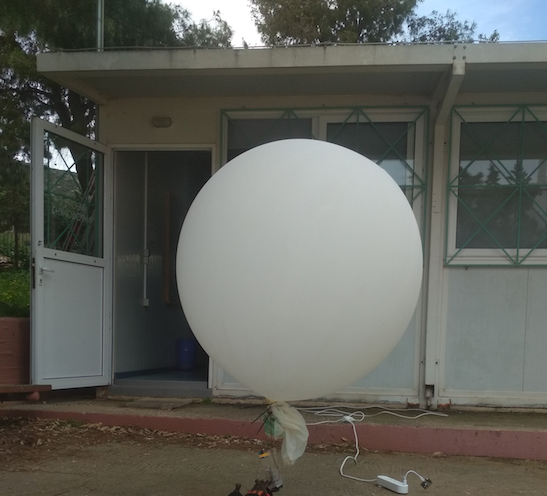

# databalloon
---
#### *`Πρόταση για το 1ο Μαθητικό Συνέδριο "Ερευνητικές Διαδρομές στον Πολιτισμό και στις Επιστήμες" ΔΔΕ Ανατολικής Αττικής`*
---
# Κατασκευή και Προγραμματισμός Αιωρούμενου Μετεωρολογικού Σταθμού. Λήψη, Επεξεργασία και Οπτικοποίηση Δεδομένων.
---
### Περίληψη
Η εργασία αφορά την κατασκευή ενός μετεωρολογικού σταθμού ο οποίος αιωρείται με τη βοήθεια ενός μετεωρολογικού μπαλονιού. Σκοπός μας ήταν να δημιουργήσουμε έναν μετεωρολογικό σταθμό, ώστε να παρακολουθούμε σε πραγματικό χρόνο διάφορα περιβαλλοντικά δεδομένα, όπως θερμοκρασία, υγρασία, βαρομετρική πίεση, υψόμετρο, περιστροφική κίνηση. Στο εργαστήριο πληροφορικής αξιοποιήσαμε τους μικροελεγκτές micro:bit για να συνθέσουμε κυκλώματα με αντίστοιχους αισθητήρες και να πειραματιστούμε με αυτά. Αρχικά ξεκινήσαμε την υλοποίηση προγραμματίζοντας μέσω του περιβάλλοντος https://makecode.microbit.org σε γλώσσα με πλακίδια. Μέσω της radio επικοινωνίας,  ένα micro:bit “αποστολέας”, εκπέμπει τα δεδομένα από τους αισθητήρες σε άλλο κοντινό micro:bit “παραλήπτη”. Αυτό με τη σειρά του στέλνει τα δεδομένα στη θύρα USB υπολογιστή, όπου προβάλλονται σε πραγματικό χρόνο σε οθόνη, ενώ παράλληλα μπορούν να αποθηκευθούν σε μορφή csv για περαιτέρω επεξεργασία με ένα υπολογιστικό φύλλο. Στην πορεία, κατά την σύνθεση του μετεωρολογικού σταθμού, τοποθετήσαμε όλα τα εξαρτήματα σε κατάλληλο κουτί το οποίο ζυγίστηκε, ενώ υπολογίσαμε το απαραίτητο μέγεθος του μπαλονιού, καθώς και την ποσότητα σε αέριο ήλιο, ώστε να μπορέσει να ανυψωθεί όλη η διάταξη. Τέλος η κατασκευή αγκυρώθηκε εξωτερικά στη στέγη του εργαστηρίου πληροφορικής, ώστε να αιωρείται αρκετά ψηλά. Από τους υπολογιστές της αίθουσας συλλέξαμε τα δεδομένα για να εξάγουμε μέγιστες, ελάχιστες και μέσες τιμές, ενώ μπορέσαμε να δημιουργήσουμε χρήσιμα γραφήματα. Η εργασία μας είναι διαθέσιμη και στο αποθετήριό μας https://github.com/robpeta/databalloon.

### Η Ιδέα
Η ιδέα προήλθε από τα μετεωρολογικά μπαλόνια (ειδικά μπαλόνια υψηλού υψομέτρου) που απελευθερώνονται για να φτάσουν στη στρατόσφαιρα, μεταφέροντας όργανα ικανά να μετρήσουν και να στείλουν πίσω στη γη χρήσιμες πληροφορίες όπως, ατμοσφαιρική πίεση, υγρασία, θερμοκρασία, ταχύτητα ανέμου. Τα μπαλόνια αυτά χρησιμοποιούνται για τη διάγνωση των τρεχουσών συνθηκών που επικρατούν στις περιοχές από όπου εκτοξεύονται. Θελήσαμε να δημιουργήσουμε στο Σχολείο μας έναν μετεωρολογικό σταθμό, ο οποίος όμως θα αιωρείται αγκυρωμένος στη σκεπή του Εργαστηρίου Πληροφορικής και θα παρέχει περίπου αντίστοιχες περιβαλλοντικές πληροφορίες με εκείνες ενός κανονικού μετεωρολογικού μπαλονιού.

### Υλικά & Μέθοδος
Η όλη σύνθεση αποτελείται από τρία κύρια μέρη: 
1. το μετεωρολογικό μπαλόνι
2. τη διάταξη ενός μικροελεγκτή με τους αισθητήρες, όπου θα προσαρτηθεί στο μπαλόνι (κύκλωμα Εικόνας 2) :
   1. 1 micro:bit για την αποστολή των δεδομένων (αποστολέας)
   2. 1 micro:bit edge connector, για την πρόσβαση στις επαφές του micro:bit
   3. 1 Αισθητήρα θερμοκρασίας και υγρασίας (dht11)
   4. 1 Αισθητήρα βαρομετρικής πίεσης και θερμοκρασίας (BMP280)
   5. 1 Αντίσταση 10 ΚΩ
   6. 1 breadboard για τη σύνθεση των κυκλωμάτων
   7. αντίστοιχα καλώδια
   8. 1 μπαταριοθήκη με καλώδιο JST-PH για τροφοδοσία
   9. 2 μπαταρίες ΑΑ
3. τους μικροελεγκτές για τη λήψη των δεδομένων:
   1. 1 micro:bit για ενδιάμεση λήψη & αναμετάδοση δεδομένων (αναμεταδότης)
   2. 1 micro:bit για την τελική λήψη δεδομένων (παραλήπτης)

#### Το Μετεωρολογικό Μπαλόνι
Το μετεωρολογικό μπαλόνι που επιλέχθηκε ζυγίζει 200g και μπορεί να σηκώσει επιπλέον βάρος 200g. Το αέριο που χρησιμοποιήθηκε είναι ήλιο, διότι θεωρείται πολύ πιο ασφαλές από το υδρογόνο το οποίο σε κατάλληλες συνθήκες εκρηγνύεται. Για το συγκεκριμένο μπαλόνι χρειάστηκε ήλιο όγκου $`0.5m^3`$ με πίεση 55mbar από μπουκάλα των 8lt (Εικόνα 1).

**Εικόνα 1**. Το μετεωρολογικό μπαλόνι έξω από το εργαστήριο πληροφορικής



#### Η Διάταξη micro:bit με τους Αισθητήρες
Το micro:bit είναι ένας μικροελεγκτής αρκετά μικρού μεγέθους, με ενσωματωμένους αισθητήρες και δυνατότητα να επικοινωνεί ασύρματα με άλλα micro:bit, ενώ παράλληλα προγραμματίζεται σε περιβάλλον με πλακίδια, καθιστώντας το έτσι ιδανικό για ένα τέτοιο έργο. Το επίσημο προγραμματιστικό περιβάλλον είναι το https://makecode.microbit.org

**Εικόνα 2**: Σχέδιο συνδεσμολογίας micro:bit με τους αισθητήρες


**Δοκιμή 1: Εύρεση εμβέλειας επικοινωνίας μεταξύ δύο micro:bit.**

Αρχικά το πρώτο πράγμα που θελήσαμε να δοκιμάσουμε ήταν η μέγιστη απόσταση από την οποία μπορούν να επικοινωνούν 2 micro:bit μεταξύ τους. Για το σκοπό αυτό προγραμματίσαμε το ένα ως “αποστολέα” (Εικόνα 3), στέλνοντας την τιμή του αισθητήρα φωτεινότητας στο άλλο, “παραλήπτη” (Εικόνα 4), στη μορφή [x = τιμή αισθητήρα]. Όταν ο “παραλήπτης” λάβει μήνυμα με όνομα μεταβλητής “x”, εμφανίζεται στην οθόνη του ένα εικονίδιο για 500ms, δηλώνοντας την επιτυχή λήψη του σήματος. Με αυτόν τον τρόπο  βρήκαμε πως η μέγιστη απόσταση επικοινωνίας μεταξύ τους είναι περίπου 18m.

**Εικόνα 3**: Πρόγραμμα micro:bit Δοκιμής 1, σε ρόλο “αποστολέα” δεδομένων.

[](https://makecode.microbit.org/_JLX3AwTbxdhs/)

**Εικόνα 4**: Πρόγραμμα micro:bit Δοκιμής 1, σε ρόλο “παραλήπτη” δεδομένων.

[](https://makecode.microbit.org/_A6E4iCC1kLoV/)

**Δοκιμή 2: Μετάδοση σήματος μέσα από τη μεταλλική στέγη.**

Με τη διάταξη των δύο micro:bit “αποστολέας” - “παραλήπτης”, δοκιμάσαμε επίσης κατά πόσο η μεταλλική στέγη του εργαστηρίου Πληροφορικής, επιτρέπει την επικοινωνία μεταξύ των δύο μικροελεγκτών. Τοποθετώντας το ένα έξω και πάνω στη στέγη και έχοντας το άλλο μέσα στο εργαστήριο, διαπιστώσαμε πως η επικοινωνία είναι εφικτή μόνο πλησιάζοντας το δεύτερο micro:bit κοντά στο ταβάνι. Αυτό σήμαινε πως όταν θα χρησιμοποιούσαμε το μετεωρολογικό μπαλόνι, τα δεδομένα από τους αισθητήρες δεν θα μπορούσαν να φτάσουν στους υπολογιστές μέσα στο εργαστήριο Πληροφορικής.

Η λύση στο πρόβλημα αυτό δόθηκε χρησιμοποιώντας ένα επιπλέον micro:bit “αναμεταδότη” το οποίο βρίσκεται σε κοινή θέα με τον “αποστολέα” και τον “παραλήπτη” (Εικόνα 5). Ο ρόλος του “αναμεταδότη” είναι: 
για όσο βρίσκεται στο κοινό κανάλι 1 (radio group 1) με τον “αποστολέα”, να αποθηκεύει τις τιμές των αισθητήρων που λαμβάνει, σε αντίστοιχες μεταβλητές. 
Στη συνέχεια μεταβαίνοντας  στο κανάλι 5 (radio group 5), να στέλνει τις τιμές αυτές στον “παραλήπτη”, μέσα στο εργαστήριο πληροφορικής.

**Εικόνα 5**: Σχεδιάγραμμα αποστολής και λήψης δεδομένων.


#### Παραγωγή και αποστολή δεδομένων
Για την εξαγωγή των δεδομένων από τους αισθητήρες dht11 (θερμοκρασίας και υγρασίας) και BMP280 (βαρομετρικής πίεσης και θερμοκρασίας) και την αποστολή αυτών σε άλλο micro:bit χρησιμοποιήθηκε το πρόγραμμα της Εικόνας 7. Οι εντολές για τη διαχείριση των δύο αισθητήρων, μπορούν να φορτωθούν στο προγραμματιστικό περιβάλλον μέσα από την ιστοσελίδα makecode.microbit.org, επιλέγοντας από την περιοχή των εντολών  και στη συνέχεια κάνοντας αναζήτηση “dht11” και “bmp280” αντίστοιχα. Το παρακάτω πρόγραμμα αποτελείται από 2 κύρια blocks:
1. [on start]: αρχικά θέτουμε το radio group σε 1, μεταξύ “αποστολέα” και “παραλήπτη” και την ισχύ μετάδοσης στο μέγιστο (7). Οι επόμενες δύο εντολές, γαλάζιου χρώματος έχουν να κάνουν με την ενεργοποίηση και την διευθυνσιοδότηση του αισθητήρα BMP280, όπως δίνεται από τον κατασκευαστή (χρησιμοποιεί πρωτόκολλο επικοινωνίας i2c).
2. [forever]: οι εντολές χρώματος πορτοκαλί, αναφέρονται στον αισθητήρα dht11. Εδώ με τις εντολές _radio send value_ τα δεδομένα “στέλνονται” κάθε 1 δευτερόλεπτο στη μορφή [“όνομα_μεταβλητής” = τιμή_μεταβλητής]. Τέλος, ο ενσωματωμένος αισθητήρας accelerometer, σχετίζεται με τις περιστροφές (_rotation (<sup>0</sup>) roll_ & _rotation (<sup>0</sup>) pitch_) (Εικόνα 6) και αξιοποιείται για να ληφθεί η κατάσταση αιώρησης του micro:bit “αποστολέα”.

**Εικόνα 6**: Σχεδιάγραμμα των περιστροφών roll και pitch που αντιλαμβάνεται ο αισθητήρας accelerometer

<p align="center">
  
</p>

**Εικόνα 7**: Πρόγραμμα “αποστολέας”


#### Λήψη και αναμετάδοση δεδομένων
Όπως προαναφέρθηκε, η απευθείας λήψη δεδομένων από το micro:bit “αποστολέα” δεν ήταν εφικτή, διότι η μεταλλική στέγη του εργαστηρίου εμπόδιζε τη μετάδοση του σήματος. Το παρακάτω πρόγραμμα (Εικόνα 8) απαρτίζεται από τρία (3) βασικά blocks: 
1. [_on start_] 2. [_forever_] και 3. [_on radio received_]

* [_on start_]: θέτουμε τη μέγιστη ισχύ μετάδοσης του σήματος (7)

* [_forever_]: τίθεται το radio group σε 1, για 1 δευτερόλεπτο, ενώ σε αυτό το χρονικό διάστημα (το radio group 1 παραμένει ενεργό), αρχίζει η επικοινωνία με τον “αποστολέα”, ενεργοποιείται το block [_on radio received_] και ξεκινούν να λαμβάνονται τα δεδομένα, τα οποία και αποθηκεύονται σε αντίστοιχες μεταβλητές όπως [_set val_P to value_] κ.ο.κ.
  
* στη συνέχεια στο block [_forever_], γίνεται μετάβαση από το radio group 1, στο radio group 5 και κατόπιν αποστέλλονται οι μεταβλητές μαζί με τις τιμές τους στο τελικό μικροελεγκτή “παραλήπτη”.   

**Εικόνα 8**: Πρόγραμμα “αναμεταδότης”


#### Τελική λήψη και εγγραφή δεδομένων στη σειριακή θύρα
Στο τελικό στάδιο της λήψης των δεδομένων, το micro:bit  “παραλήπτης”, ο,τι λαμβάνει το στέλνει μέσω της θύρας USB σε υπολογιστή (Εικόνα 9). 

**Εικόνα 9**: Πρόγραμμα “παραλήπτης”


**Μετατροπή Βαρομετρικής Πίεσης σε υψόμετρο**

Επειδή η ατμοσφαιρική πίεση μεταβάλλεται με το υψόμετρο, οι τιμές της βαρομετρικής πίεσης που λαμβάνονται από τον αισθητήρα BMP280, μπορούν να μας δώσουν πληροφορίες για το υψόμετρο σε (m), χρησιμοποιώντας τον παρακάτω βαρομετρικό τύπο:

<div align="center">
   
$`Altitude=44330\cdot\left({1-{\left(\frac{P}{Po}\right)}^{\frac{1}{5.255}}}\right)`$

</div>

P: η τρέχουσα τιμή του αισθητήρα σε Pascal (Pa)
<br>
Po: η ατμοσφαιρική πίεση στο επίπεδο της θάλασσας, συνήθως 101325 Pa για θερμοκρασία 15 <sup>0</sup>C.

Ωστόσο, στο περιβάλλον makecode.microbit.org, η υλοποίηση του παραπάνω βαρομετρικού τύπου επιστρέφει μηδενικές τιμές για το υψόμετρο, διότι η δύναμη: $`{\left(\frac{P}{Po}\right)}^{\frac{1}{5.255}}`$, στρογγυλοποιείται από το προγραμματιστικό περιβάλλον σε 1. Όταν για παράδειγμα P=100725 (Pa) η δύναμη θα  έπρεπε να δίνει 0,998872 αντί για 1. Ως αποτέλεσμα η διαφορά $`\left({1-{\left(\frac{P}{Po}\right)}^{\frac{1}{5.255}}}\right)`$ γίνεται 0 αντί $`{1,1278\cdot10^{-3}}`$ και στη συνέχεια το τελικό υψόμετρο υπολογίζεται σε 0m, ενώ χωρίς τις ενδιάμεσες στρογγυλοποιήσεις θα ήταν 50,073m. Για το λόγο αυτό επιλέχτηκε το πρόγραμμα “παραλήπτης” να υλοποιηθεί σε MicroPython και συγκεκριμένα στο online προγραμματιστικό περιβάλλον (https://python.microbit.org/v/3), μια έκδοση της Python για τον μικροελεγκτή micro:bit, η οποία υποστηρίζει βιβλιοθήκες όπως η _math_, ώστε η υλοποίηση τής ύψωσης σε δύναμη να γίνει με τη συνάρτηση: 

<div align="center">
   
_**math.pow( (P/Po), (1/5.255) )**_

</div>

Στην Εικόνα 10 φαίνεται το πρόγραμμα micro:bit “παραλήπτης”. Στη γραμμή 13 ρυθμίζεται το radio group σε 5 για την επικοινωνία με τον “αναμεταδότη”. Η υλοποίηση του βαρομετρικού τύπου γίνεται στη γραμμή 23. Όλες οι τιμές των αισθητήρων αποθηκεύονται στη μεταβλητή message και στέλνονται στην USB θύρα με την εντολή print.

**Εικόνα 10**: Το πρόγραμμα “παραλήπτης” σε MicroPython

```python
# Πρόγραμμα "παραλήπτης"
# 1. Λαμβάνει δεδομένα από το πρόγραμμα "αναμεταδότη"
# 2. Υπολογίζει το υψόμετρο από την τρέχουσα ατμοσφαιρική πίεση
# 3. Στέλνει όλα τα δεδομένα στη θύρα USB

from microbit import *
import math
import make_radio

# Ατμοσφαιρική πίεση στο επίπεδο της θάλασσας σε (Pa)
p0=101325

radio = make_radio.MakeRadio(group=5)
radio.off()
radio.on()

while True:
    message=radio.receive_packet()
    if message:
        k=message[:4]
        if k=="Pres":
            Ps = int(str(message[5:]))
            Alti = 44330 * (1 - math.pow((Ps/p0),(1/5.255)) )
            print('Pres:%.2f' %Ps)               
            print('Alti:%.2f' %Alti)
        else:
            print(message)
```


#### WebUSB, σειριακή εγγραφή, oπτικοποίηση και αποθήκευση δεδομένων.
Το προγραμματιστικό περιβάλλον makecode.microbit.org, υποστηρίζει την τεχνολογία  WebUSB, ένα χαρακτηριστικό των σύγχρονων φυλλομετρητών (όπως Google Chrome, Chromium, Microsoft Edge, Opera, κ.α.) όπου μέσω ιστοσελίδας, ένας browser μπορεί να επικοινωνήσει απευθείας με συσκευές συνδεδεμένες στη θύρα USB. Αυτό πρακτικά δίνει τη δυνατότητα στο micro:bit να διαβάζει και να στέλνει ζωντανά σειριακά δεδομένα, σε  υπολογιστή. Έτσι μέσω του online προγραμματιστικού περιβάλλοντος μπορούν να προβληθούν σε πραγματικό χρόνο δεδομένα και γραφικές παραστάσεις (data logging) (Εικόνα 11).

**Εικόνα 11**: Στιγμιότυπο από την ιστοσελίδα makecode.microbit.org με δεδομένα σε πραγματικό χρόνο.


Οι εντολές **serial write value (name) = (value)** στην Εικόνα 9 και **print(message)**  στην Εικόνα 10, στέλνουν τα δεδομένα στη θύρα USB. Με το micro:bit συνδεδεμένο σε αυτή, μπορούμε να πάρουμε πληροφορίες όμοιες με εκείνες της Εικόνας 11, επιλέγοντας στο περιβάλλον makecode.microbit.org, το κουμπί **Show data Device**.
Στη συνέχεια έχουμε τη δυνατότητα να αποθηκεύσουμε τα δεδομένα μας σε μορφή csv, επιλέγοντας το μπλε κουμπί (Export data) στο πάνω δεξιά μέρος του παραθύρου 

Το αρχείο που θα κατέβει στον υπολογιστή μας μπορούμε να το ανοίξουμε ως υπολογιστικό φύλλο.
