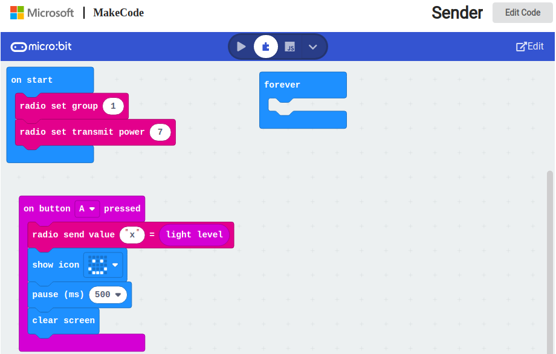

## Radio Επικοινωνία μικροελεγκτών micro:bit. Μέτρηση Εμβέλειας

Πρόγραμμα αποστολής δεδομένων αισθητήρα "ένταση φωτεινότητας" [light level] από ένα micro:bit σε ένα άλλο, προκειμένου να γίνει μέτρηση εμβέλειας Sender--->Receiver

